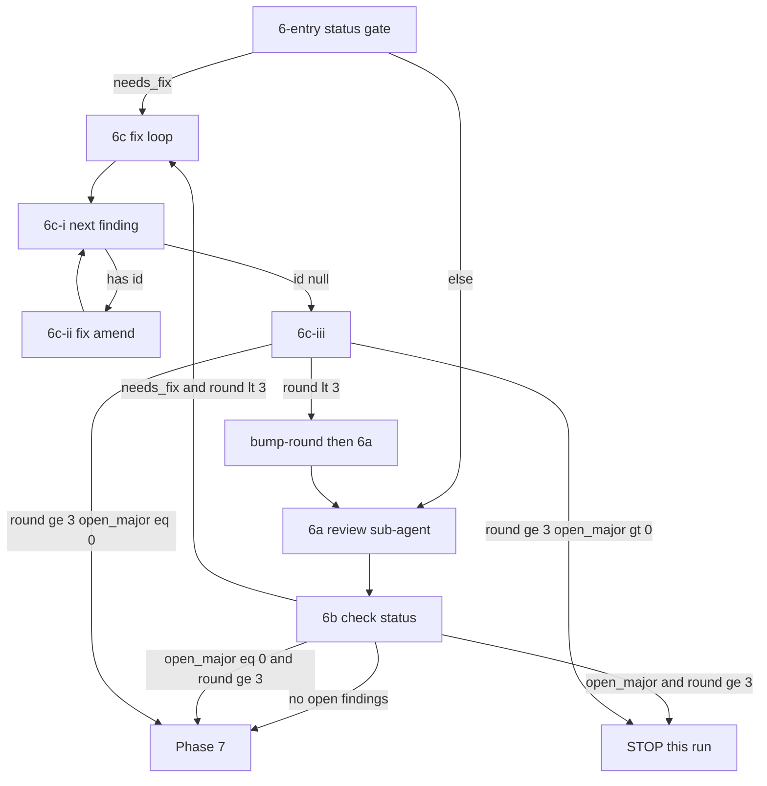

# Apply Review Loop (Phase 6)

Shared orchestration for `/spex apply` and `/spex apply-one-step`.
Load and follow this document exactly for Phase 6.

## Flow Overview



## Round Model

1. At most **3** review passes (`round` is 1, 2, or 3). `round`
   never exceeds 3 (`review-helper bump-round` enforces this).
2. Round N means the N-th review sub-agent pass on the step commit.
3. After a review in rounds 1–2 with open findings (major **or**
   minor): run the fix loop, then bump and re-review.
4. After a review in round 3:
   - no open majors → proceed to Phase 7 (open minors may remain);
   - open majors remain → **STOP this run** (do not mark the task
     complete; do not enter 6c after that review pass).
5. **STOP means pause this invocation only.** Do not run Phase 7+.
   On a later `/spex apply` or `/spex apply-one-step`, Phase 3
   resumes with `resume_phase=review`, then **6-entry** routes to
   **6c** while `needs_fix` is true (even at `round == 3`) so
   leftover findings can be fixed. Never bump or re-review past
   round 3; after fixes, if `open_major == 0`, proceed to Phase 7.

## Orchestration Rules (required)

The main agent orchestrates this phase. Launch a fresh **review
sub-agent** and (when needed) a fresh **fix sub-agent** each
round.

- Run each `review-helper` / `prompt` command as its **own** shell
  invocation. Do not chain init + prompt + python one-liners.
- Parse JSON from **stdout** yourself (tool output). Status/info
  lines on stderr (e.g. template sync) must be ignored.
- Shell variables such as `$commit_sha` are not Python names — never
  reference them inside `python3 -c` unless you expand them in the
  shell string first.
- Sub-agent / amend verification failures: relaunch **at most once**;
  if it still fails, stop and report.

## 6-entry. Resume / continue gate

Resolve `$commit_sha`, then branch on status:

```bash
$spex_skill_dir/scripts/spex review-helper --name $spec_name \
  status --step "$current_task_id" --json
```

Also resolve the current tip:

```bash
git rev-parse --short HEAD
```

Save as `$head_sha`. Set `$commit_sha` in this order:

1. If status JSON `"commit_sha"` is non-empty **and** equals
   `$head_sha`, use that value.
2. If status JSON `"commit_sha"` is non-empty **but differs** from
   `$head_sha`: the review file is stale after an amend — use
   `$head_sha`, then heal the file (only when `exists` is true):

   ```bash
   $spex_skill_dir/scripts/spex review-helper --name $spec_name \
     set-commit --step "$current_task_id" --commit "$commit_sha"
   ```

3. Otherwise, if `$commit_sha` is already set from Phase 5, keep it.
4. Otherwise: `$commit_sha=$head_sha`.

Then:

- If `"needs_fix": true`: open findings remain — go to **6c**
  (fix loop). Do not start a new review first. (Allowed at any
  `round`, including 3, so resume can finish leftover findings.)
- Otherwise: go to **6a** (start or continue review).

## 6a. Review sub-agent

Do **not** run `review-helper init`. The review file is created
lazily on the first `append`. If the review finds nothing, do not
create any `review-step-*.json` file.

Run (alone — do not pipe through ad-hoc scripts):

```bash
$spex_skill_dir/scripts/spex prompt apply-review --json \
  --name $spec_name --commit "$commit_sha"
```

Parse the JSON object from stdout. Save `$review_prompt` from the
`"prompt"` field (and optionally `"review_round"` /
`"review_file"`). Pass `$review_prompt` directly to a **review
sub-agent** as its instructions — do not rewrite it via shell
helpers. The review sub-agent must only record findings via
`review-helper append` (with `--commit`) — it must not modify
source code, must not call `init`, and must not call `bump-round`.

## 6b. Check status (after a review pass)

Run:

```bash
$spex_skill_dir/scripts/spex review-helper --name $spec_name \
  status --step "$current_task_id" --json
```

Parse the JSON. Match **in order** (do not skip steps). Decide from
`needs_fix`, `open_major`, and `round` — **do not** use
`ready_to_complete` alone to enter Phase 7 (it is false while
open minors remain in rounds 1–2, and true at max round when only
minors remain).

1. If `"needs_fix": false` (no open findings — including when no
   review file was created because the review found nothing):
   refresh `$commit_title` with `git log -1 --pretty="%h: %s"` and
   proceed to Phase 7.
2. If `"open_major"` > 0 and `"round"` >= 3: **STOP this run**,
   report remaining open major findings, and do not mark the task
   complete. Do **not** enter 6c after this review pass. A later
   invocation resumes via 6-entry → 6c (see Round Model).
3. If `"open_major"` == 0 and `"round"` >= 3: refresh
   `$commit_title` and proceed to Phase 7 (remaining open minors
   may stay unfinished). At max round this matches
   `"ready_to_complete": true`, but earlier rounds must still fix
   minors via rule 4.
4. **Otherwise** (`needs_fix` is true and round < 3): you **MUST**
   continue to 6c and launch the fix loop. Never proceed to
   Phase 7 while open findings remain in rounds 1–2 — this includes
   minor-only reviews. A review file always exists when
   `needs_fix` is true.

## 6c. Fix loop — one finding at a time

Enter when 6-entry or 6b routed here with `needs_fix: true` (a
review file already exists). Fix findings **serially**. Never
batch-fix or batch-mark multiple findings in one sub-agent pass
(that produces identical `completed_at` timestamps). **Amend after
every single finding.**

### 6c-i. Pick next open finding

```bash
$spex_skill_dir/scripts/spex review-helper --name $spec_name \
  next --step "$current_task_id"
```

Parse JSON from stdout:

- If `"id"` is `null` / empty: all findings for this round are
  marked complete — go to **6c-iii**.
- Otherwise set `$finding_id` from `"id"` and continue to 6c-ii.

### 6c-ii. Fix + amend one finding

```bash
$spex_skill_dir/scripts/spex prompt apply-fix --json \
  --name $spec_name --commit "$commit_sha" \
  --finding-id "$finding_id"
```

Parse `"prompt"` into `$fix_prompt`. Launch a **fresh fix
sub-agent** with `$fix_prompt`. That sub-agent must:

- Fix **only** `$finding_id`
- Call `review-helper edit --id $finding_id --completed-at now`
  after that single fix (not before, not for other ids)
- **Amend immediately** after marking that finding complete
- **Not** mark other findings complete
- **Not** call `bump-round`

Amend constraints:

- `HEAD` must still be `$commit_sha` / the step commit under review.
- The commit must not have been pushed to a remote.
- Do not amend someone else's commit.
- Do NOT stage any files under `$spex_root/`.

After the fix sub-agent returns:

- Verify `$finding_id` has a non-empty `completed_at`. If not,
  relaunch once; if it still fails, stop and report.
- Refresh the SHA after this amend with
  `git rev-parse --short HEAD`. Save to `$commit_sha` (required —
  the next finding amends this new HEAD).
- Persist the new tip into the review file so resume does not use
  a stale SHA:

  ```bash
  $spex_skill_dir/scripts/spex review-helper --name $spec_name \
    set-commit --step "$current_task_id" --commit "$commit_sha"
  ```

- Go back to **6c-i** for the next open finding.

### 6c-iii. Bump round or finish (hard cap)

When `next` reports no open findings, decide whether to re-review:

```bash
$spex_skill_dir/scripts/spex review-helper --name $spec_name \
  status --step "$current_task_id" --json
```

- If `"round"` < 3: bump round and sync `commit_sha` (findings
  preserved), then go back to **6a**:

  ```bash
  $spex_skill_dir/scripts/spex review-helper --name $spec_name \
    bump-round --step "$current_task_id" --commit "$commit_sha"
  ```

  Confirm stdout JSON shows the new `round` and `commit_sha`. Then
  go back to **6a** (fresh review sub-agent on the latest amended
  commit).

- If `"round"` >= 3: **do not bump** and **do not re-review**.
  - If `"open_major"` == 0: refresh `$commit_title` and proceed
    to Phase 7.
  - If `"open_major"` > 0: report remaining open major findings
    and **STOP this run** (do not mark the task complete; resume
    later via 6-entry → 6c).

If `bump-round` exits non-zero because the round cap was reached,
treat it the same as the `round >= 3` case (never force a fourth
review).
