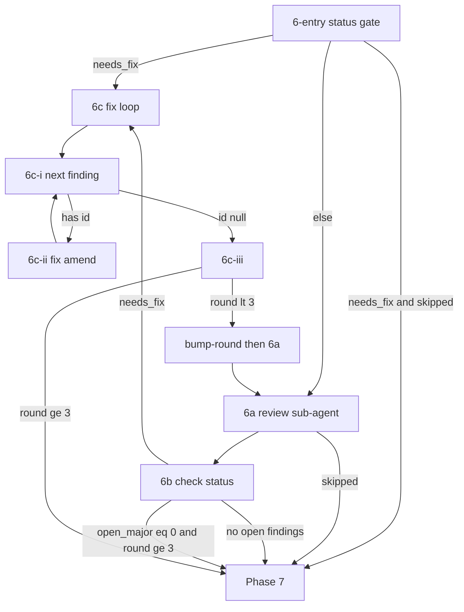

# Apply Review Loop (Phase 6)

Shared orchestration for `/spex apply` and `/spex apply-one-step`.
Load and follow this document exactly for Phase 6. **SSOT** for
STOP / 6c rules — commands and `apply-task-phases.md` only Load
this file.

Load and follow `references/cli-contract.md` exactly for helper
exit codes, stdout/stderr, quoting, and one-helper-per-shell.

## Invariants (do not weaken)

1. **Durable entry:** `$did_commit` true **or** non-empty
   `commit_title` + empty `completed_at` → set `$did_commit`←`true`;
   else skip to Phase 7 (no load for skip-commit without commit).
2. **STOP** only for abnormal failures (fix/amend verify fails
   after relaunch) — not for round-3 open majors.
3. At most **3** review passes. Round-3 open majors → **6c**
   same invocation; never bump or re-review past 3.
4. `"skipped": true` (`step_review=false`) is **not** STOP → Phase 7.
5. Abnormal STOP ends whole invocation (apply: no 7/8/9 / next
   task/`$specs`; one-step: no Phase 7/8); step stays incomplete.
6. Prefer `status`/`next`/`show`; no re-status after 6b or bump-round.
7. Single render: `$review_prompt` / round; `$fix_prompt` / finding.
8. After review/fix: `ensure-branch` — never `git checkout` to fix HEAD.
9. Orthogonal to `step_review` — probe via `prompt apply-review --json`
   only (do **not** read `.spex.toml`).

**Caller precondition:** same as durable entry. Steps with
`skip_commit` that skipped commit → Phase 7 without loading this
file.

## Flow Overview



## 6-entry. Resume / continue gate

Resolve `$commit_sha`, then branch on status (**once**):

```bash
$spex_skill_dir/scripts/spex review-helper --name "$spec_name" \
  status --step "$current_task_id" --json
```

- IF non-zero exit -> report stderr -> STOP
- ELSE parse JSON stdout; keep that object for the decisions below.

Also resolve the current tip:

```bash
git rev-parse --short HEAD
```

Save as `$head_sha`. Set `$commit_sha` in this order:

1. If status JSON `"commit_sha"` is non-empty **and** equals
   `$head_sha`, use that value.
2. If status JSON `"commit_sha"` is non-empty **but differs** from
   `$head_sha`: the review file is stale after an amend — set
   `$commit_sha` ← `$head_sha` **first**, then heal the file with
   that value (only when `exists` is true):

   ```bash
   $spex_skill_dir/scripts/spex review-helper --name "$spec_name" \
     set-commit --step "$current_task_id" --commit "$commit_sha"
   ```

3. Otherwise, if `$commit_sha` is already set from Phase 5, keep it.
4. Otherwise: `$commit_sha=$head_sha`.

Then:

- If `"needs_fix": true`: detect disabled step review **only** via
  this probe (do **not** read `.spex.toml` / config for the
  decision):

  ```bash
  $spex_skill_dir/scripts/spex prompt apply-review --json \
    --name "$spec_name" --commit "$commit_sha"
  ```

  - IF non-zero exit -> report stderr -> STOP
  - ELSE parse JSON stdout:
    - If `"skipped": true`: do **not** enter **6c**.
      Refresh `$commit_title` with `git log -1 --pretty="%h: %s"` and
      proceed to Phase 7. Do **not** cache this response as
      `$review_prompt` (no 6a this invocation).
    - ELSE (not skipped): open findings remain — go to **6c** (fix
      loop). Do not start a new review first. Do **not** cache the
      probe `"prompt"` as `$review_prompt`. (Interrupted earlier
      invocations with `needs_fix` still true resume via Phase 3
      `resume_phase=review` into this gate → **6c** at any `round`,
      including 3, unless the probe returned `"skipped": true`.)
- Otherwise: go to **6a** (start or continue review).

`$var` names here are agent context variables (see SKILL Variable
Model). Expand to literals when composing commands; do not rely on
shell state between tool calls.

## 6a. Review sub-agent

Do **not** run `review-helper init`. The review file is created
lazily on the first `append`. If the review finds nothing, do not
create any `review-step-*.json` file.

**Single prompt render:** run `prompt apply-review` at most once per
review round. After a zero exit, parse `"prompt"` from stdout JSON
into agent memory as `$review_prompt` and reuse it for launch and
relaunch. Do **not** re-run for the same round because verification
failed or a sub-agent returned incomplete work — unless the cache
was lost (e.g. new session). Track scope with
`$review_prompt_round` (current review round). Reuse a cached
prompt **only** when `$review_prompt_round` matches the current
round; otherwise treat the cache as empty and render again.

Run (alone — do not pipe through ad-hoc scripts):

```bash
$spex_skill_dir/scripts/spex prompt apply-review --json \
  --name "$spec_name" --commit "$commit_sha"
```

- IF non-zero exit -> report stderr -> STOP
- ELSE parse the JSON object from stdout:
  - If `"skipped": true`: do **not** launch a review sub-agent and
    do **not** pass an empty `"prompt"` to one. This is **not** a
    loop STOP. Refresh `$commit_title` with
    `git log -1 --pretty="%h: %s"` and proceed to Phase 7.
    Orchestration keys off `"skipped": true`.
  - ELSE: Save `$review_prompt` from the `"prompt"` field and set
    `$review_prompt_round` from `"review_round"` in the same JSON
    (or from review `status --json` `"round"` if absent).
    If `$review_prompt` is already set **and**
    `$review_prompt_round` equals the current review round, reuse
    it — do **not** run `prompt apply-review` again. Otherwise
    clear the cached review prompt and its round marker, then run
    the command above. Pass `$review_prompt` directly to a
    **review sub-agent** as its instructions — do not rewrite it
    via shell helpers. Full constraints: Appendix B. In short: the
    review sub-agent must only `append` findings (with `--commit`);
    must not modify source, call `init` / `bump-round`, or run
    `git checkout` / `git switch` / `git reset` / `git stash`.

After the review sub-agent returns, re-attach if it left detached
HEAD (no apply hooks — safe mid-loop):

```bash
$spex_skill_dir/scripts/spex apply-helper ensure-branch \
  --name "$spec_name"
```

`ensure-branch` may fail when detached HEAD carries commits that
are not ancestors of `spex_branch` (re-attaching would discard
them). Treat non-zero exit as abnormal STOP: report the recovery
command from stderr (typically `git branch -f <branch> <sha>`) to
the user and do not continue.

Then continue to **6b**.

## 6b. Check status (after a review pass)

Run status **once**:

```bash
$spex_skill_dir/scripts/spex review-helper --name "$spec_name" \
  status --step "$current_task_id" --json
```

- IF non-zero exit -> report stderr -> STOP
- ELSE parse that JSON and decide — do **not** re-run status before
  entering 6c or Phase 7. Match **in order** (do not skip steps).
  Decide from `needs_fix`, `open_major`, and `round` — **do not**
  use `ready_to_complete` alone to enter Phase 7 (it is false while
  open minors remain in rounds 1–2, and true at max round when only
  minors remain).

1. If `"needs_fix": false` (no open findings — including when no
   review file was created because the review found nothing):
   refresh `$commit_title` with `git log -1 --pretty="%h: %s"` and
   proceed to Phase 7.
2. If `"open_major"` == 0 and `"round"` >= 3: refresh
   `$commit_title` and proceed to Phase 7 (remaining open minors
   may stay unfinished). At max round this matches
   `"ready_to_complete": true`, but earlier rounds must still fix
   minors via rule 3. Round N is the N-th review sub-agent pass on
   the step commit; after rounds 1–2 with any open findings
   (major or minor), the path is fix → bump → re-review.
3. **Otherwise** (`needs_fix` is true — including when
   `"round"` >= 3 and `"open_major"` > 0): you **MUST** continue
   to 6c and launch the fix loop. Never proceed to Phase 7 while
   open majors remain, and never leave round-3 majors unfixed in
   this invocation. In rounds 1–2 this also includes minor-only
   reviews. A review file always exists when `needs_fix` is true.

## 6c. Fix loop — one finding at a time

Enter when 6-entry or 6b routed here with `needs_fix: true` (a
review file already exists). Fix findings **serially**. Never
batch-fix or batch-mark multiple findings in one sub-agent pass
(that produces identical `completed_at` timestamps). **Amend after
every single finding.**

### 6c-i. Pick next open finding

Use `next` only — do **not** call `status` here:

```bash
$spex_skill_dir/scripts/spex review-helper --name "$spec_name" \
  next --step "$current_task_id"
```

- IF non-zero exit -> report stderr -> STOP
- ELSE parse JSON from stdout:
  - If `"id"` is `null` / empty: all findings for this round are
    marked complete — go to **6c-iii**.
  - Otherwise set `$finding_id` from `"id"`. If `$finding_id` differs
    from `$fix_prompt_finding_id`, clear the cached fix prompt and
    its finding-id marker before continuing to **6c-ii**.

### 6c-ii. Fix + amend one finding

**Single prompt render:** run `prompt apply-fix` at most once per
`$finding_id`. After a zero exit, parse `"prompt"` into agent
memory as `$fix_prompt` and reuse for launch/relaunch. Do **not**
re-run for the same finding unless the cache was lost. Track scope
with `$fix_prompt_finding_id`. Reuse only when the companion
matches `$finding_id`; otherwise treat the cache as empty.

```bash
$spex_skill_dir/scripts/spex prompt apply-fix --json \
  --name "$spec_name" --commit "$commit_sha" \
  --finding-id "$finding_id"
```

- IF non-zero exit -> report stderr -> STOP
- ELSE parse `"prompt"` from JSON stdout into `$fix_prompt` and set
  `$fix_prompt_finding_id="$finding_id"`. If `$fix_prompt` is already
  set **and** `$fix_prompt_finding_id` equals `$finding_id`, reuse it —
  do **not** run `prompt apply-fix` again for the same finding.
  Otherwise clear the cached fix prompt and its finding-id marker,
  then run the command above. Launch a **fresh fix sub-agent** with
  `$fix_prompt`. That sub-agent must:

- Fix **only** `$finding_id`
- Call `review-helper edit --id "$finding_id" --completed-at now`
  after that single fix (not before, not for other ids)
- **Amend immediately** after marking that finding complete
- **Not** mark other findings complete
- **Not** call `bump-round`
- **Not** run `git checkout` / `git switch` / `git reset`
  (checkout-by-SHA detaches HEAD)

Amend constraints:

- `HEAD` must still be `$commit_sha` / the step commit under review.
- The commit must not have been pushed to a remote.
- Do not amend someone else's commit.
- Do NOT stage any files under `$spex_root/`.

After the fix sub-agent returns:

- Verify `$finding_id` has a non-empty `completed_at`:

  ```bash
  $spex_skill_dir/scripts/spex review-helper --name "$spec_name" \
    show --step "$current_task_id" --id "$finding_id" --json
  ```

  IF non-zero exit -> report stderr -> STOP. ELSE require a
  non-empty `completed_at` in the JSON. If not, relaunch the fix
  sub-agent once with the same `$fix_prompt`; if it still fails,
  stop and report.
- Re-attach if the fix agent left detached HEAD:

  ```bash
  $spex_skill_dir/scripts/spex apply-helper ensure-branch \
    --name "$spec_name"
  ```

  `ensure-branch` may fail when detached HEAD carries commits that
  are not ancestors of `spex_branch` (re-attaching would discard
  them). Treat non-zero exit as abnormal STOP: report the recovery
  command from stderr (typically `git branch -f <branch> <sha>`) to
  the user and do not continue.

- Refresh the SHA after this amend with
  `git rev-parse --short HEAD`. Save to `$commit_sha` (required —
  the next finding amends this new HEAD).
- Persist the new tip into the review file so resume does not use
  a stale SHA:

  ```bash
  $spex_skill_dir/scripts/spex review-helper --name "$spec_name" \
    set-commit --step "$current_task_id" --commit "$commit_sha"
  ```

- Go back to **6c-i** for the next open finding.

### 6c-iii. Bump round or finish (hard cap)

When `next` reports no open findings, run status **once** to decide
whether to re-review (do not status again after this decision):

```bash
$spex_skill_dir/scripts/spex review-helper --name "$spec_name" \
  status --step "$current_task_id" --json
```

- IF non-zero exit -> report stderr -> STOP
- ELSE parse JSON stdout:
  - If `"round"` < 3: bump round and sync `commit_sha` (findings
    preserved), then go back to **6a**:

    ```bash
    $spex_skill_dir/scripts/spex review-helper --name "$spec_name" \
      bump-round --step "$current_task_id" --commit "$commit_sha"
    ```

    IF non-zero exit (and not the round-cap case below) -> report
    stderr -> STOP. ELSE confirm stdout JSON shows the new `round`
    and `commit_sha` — that is enough; do **not** re-run `status`
    after a successful bump. Clear the cached review prompt and its
    round marker so **6a** renders a fresh `prompt apply-review` for
    the new round. Then go back to **6a** (fresh review sub-agent on
    the latest amended commit).

  - If `"round"` >= 3: **do not bump** and **do not re-review**.
    Refresh `$commit_title` and proceed to Phase 7. (After a
    successful fix loop, `open_major` should be 0. If fix/amend
    verification failed earlier, that path already stopped and
    reported.) Round 3 is the last review pass: open majors must
    already have been fixed in **6c** this same invocation; open
    minors may remain. Never force a fourth review.

If `bump-round` exits non-zero because the round cap was reached,
treat it the same as the `round >= 3` case (never force a fourth
review).

## Appendix A: Call-frequency optimisation

**Avoid redundant status / next / show.** Call each helper only at
the step that needs it. Reuse the last parsed JSON in agent memory
— there is no process-level status cache.

| Step | Required call | Do not |
|------|---------------|--------|
| 6-entry | `status --json` once | re-status before routing |
| 6b (after review) | `status --json` once | re-status before 6c / Phase 7 |
| 6c-i (pick finding) | `next` only | `status` (reuse prior JSON) |
| 6c-ii (verify fix) | `show --id` once | `status` |
| 6c-iii (`next` null) | `status --json` once | re-status after bump-round |

Never re-run `status --json` immediately after an unchanged status
result (same step, same argv, seconds apart). After 6b routes to
6c, start at **6c-i** with `next` — do not status again first.
After `bump-round` stdout confirms the new `round`, go to **6a**
without another status.

**review-helper CLI:**

```text
REQUIRED: --name <spec> on every invocation
REQUIRED: --step <id> for most subcommands (status, next, show,
          append, edit, bump-round, set-commit, list, get)
USE:      status --json | next | show --step S [--id ID]
ALIASES:  list → show summary; get → show --id
```

`--name` is always required. Prefer `status` / `next` / `show`.
`list` and `get` are supported aliases of `show` (compat); use them
only with `--name` and `--step` as needed. To inspect one finding
(e.g. verify `completed_at`), use
`show --step "$current_task_id" --id "$finding_id" --json`
(or `get --step … --id …`).

## Appendix B: Sub-agent constraints

- **Review sub-agent:** record findings only via `review-helper
  append` (with `--commit`). Must not modify source code, must not
  call `init`, must not call `bump-round`, and must **not** run
  `git checkout` / `git switch` / `git reset` / `git stash`
  (checkout-by-SHA leaves detached HEAD even when the SHA is the
  branch tip).
- **Fix sub-agent:** fix only `$finding_id`; mark that finding
  complete then **amend immediately**; do not mark other findings;
  do not call `bump-round`; do not run `git checkout` /
  `git switch` / `git reset`.
- Sub-agent / amend verification failures: relaunch **at most once**;
  if it still fails, stop and report (abnormal STOP).
- Debug timeline: with debug enabled, `prompt apply-review` and
  `review-helper bump-round` append APPLY anchors to
  `$spec_path/debug.log` automatically. Agent need not intervene.
- Never reference `$commit_sha` (or other `$var`) inside
  `python3 -c` unless already expanded to a literal in the command
  text.
