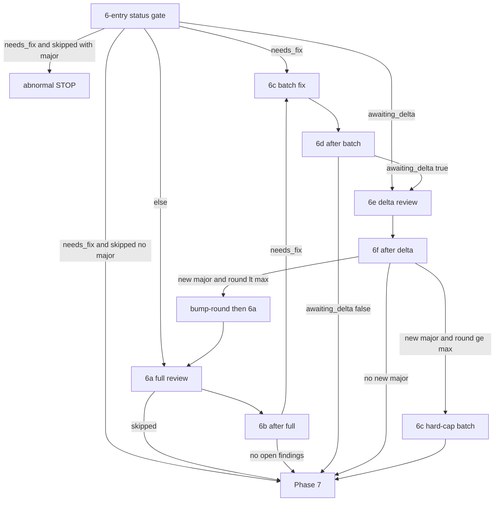

# Apply Review Loop (Phase 6)

Shared orchestration for `/spex apply` and `/spex apply-one-step`.
Load and follow this document exactly for Phase 6. **SSOT** for
STOP / 6c rules — commands and `apply-task-phases.md` only Load
this file.

Load and follow `references/cli-contract.md` exactly for helper
exit codes, stdout/stderr, quoting, and one-helper-per-shell.

## Invariants (do not weaken)

1. **Durable entry:** `$did_commit` true **or** non-empty `commit_title` + empty `completed_at` → `$did_commit`←`true`; else Phase 7 (skip-commit without commit).
2. **STOP** only for abnormal failures (fix/amend/complete-batch verify fails after relaunch) — not for open majors at the max review round (currently 3); those stay in **6c**.
3. The max review round (currently 3) caps **full** passes only; delta review does **not** increment `round`; never a fourth full review.
4. `"skipped": true` (`step_review=false`) with **no** open major → Phase 7 (not STOP). Open major + `step_review=false` → abnormal STOP.
5. Abnormal STOP ends whole invocation (apply: no 7/8/9 / next task/`$specs`; one-step: no Phase 7/8); step stays incomplete.
6. Prefer `status`/`open-batch`/`show`; no re-status after 6b or bump-round.
7. Single render: `$review_prompt`/(round+mode); `$fix_prompt`/batch-ids. **Cache check before** every prompt CMD.
8. After review/fix: `ensure-branch` — never `git checkout` to fix HEAD.
9. Orthogonal to `step_review` — probe via `prompt apply-review --json` only (do **not** read `.spex.toml`).

**Caller precondition:** same as durable entry. Steps with
`skip_commit` that skipped commit → Phase 7 without loading this
file.

## Flow Overview



**Route table (severity × resume):**

| State | Route |
|-------|-------|
| Full review, 0 open findings | Phase 7 |
| Full review, minor-only open | **6c** → verify → Phase 7 (**no** delta, **no** Round 2) |
| Full review, any major open | **6c** → verify → **6e** delta |
| Delta, no new major | Phase 7 |
| Delta, new major, round < max | bump-round → **6a** full |
| Delta, new major, round = max | **6c** (fix majors) → Phase 7 (no 4th full, **no** further delta) |
| Resume `needs_fix` | **6c** (rebuild batch from open findings) |
| Resume `awaiting_delta` (major batch completed, delta not run) | **6e** |
| `step_review=false`, open major | abnormal STOP |
| `step_review=false`, no open major | Phase 7 |

## 6-entry. Resume / continue gate

Resolve `$commit_sha`, then branch on status (**once**):

```bash
$spex_skill_dir/scripts/spex review-helper --name "$spec_name" \
  status --step "$current_task_id" --json
```

- IF non-zero exit -> report stderr -> STOP
- ELSE parse JSON stdout; keep that object for the decisions below.

Also resolve the current tip:

```bash
git rev-parse --short HEAD
```

Save as `$head_sha`. Set `$commit_sha` in this order:

1. If status JSON `"commit_sha"` is non-empty **and** equals
   `$head_sha`, use that value.
2. If status JSON `"commit_sha"` is non-empty **but differs** from
   `$head_sha`: before healing, compare `$head_sha` with the short
   SHA prefix recorded in the step's `commit_title` in `todo.json`.
   Matching means `$head_sha` is the original step commit or an
   amend of it. If they match, set `$commit_sha` ← `$head_sha` and
   heal the file with that value (only when `exists` is true). If
   they do not match, report the review `commit_sha`, `$head_sha`
   and the todo SHA, then abnormal STOP for the user to resolve.

   ```bash
   $spex_skill_dir/scripts/spex review-helper --name "$spec_name" \
     set-commit --step "$current_task_id" --commit "$commit_sha"
   ```

3. Otherwise, if `$commit_sha` is already set from Phase 5, keep it.
4. Otherwise: `$commit_sha=$head_sha`.

Then (match **in order**):

- If `"needs_fix": true`: detect disabled step review **only** via
  this probe (do **not** read `.spex.toml` / config for the
  decision):

  ```bash
  $spex_skill_dir/scripts/spex prompt apply-review --json \
    --name "$spec_name" --commit "$commit_sha"
  ```

  - IF non-zero exit -> report stderr -> STOP
  - ELSE parse JSON stdout:
    - If `"skipped": true` **and** status `"open_major"` > 0:
      abnormal STOP — `step_review=false` must not silently ignore
      open majors. Do **not** enter **6c** or Phase 7.
    - If `"skipped": true` **and** `"open_major"` == 0: do **not**
      enter **6c**. Refresh `$commit_title` with
      `git log -1 --pretty="%h: %s"` and proceed to Phase 7. Do
      **not** cache this response as `$review_prompt` (no 6a this
      invocation).
    - ELSE (not skipped): open findings remain — go to **6c** (batch
      fix). Do not start a new review first. Do **not** cache the
      probe `"prompt"` as `$review_prompt`. (Interrupted earlier
      invocations with `needs_fix` still true resume via Phase 3
      `resume_phase=review` into this gate → **6c** at any `round`,
      including the max review round (currently 3), unless the probe
      returned `"skipped": true`.)
- Else if status `"awaiting_delta": true` (major batch already
  `complete-batch`'d; `needs_fix` is false; durable marker set):
  go to **6e**. Do **not** start **6a** full and do **not** skip to
  Phase 7.
- Otherwise: go to **6a** with `$review_mode=full` (start or continue
  full review). Round 1 always performs full review.

`$var` names here are agent context variables (see SKILL Variable
Model). Expand to literals when composing commands; do not rely on
shell state between tool calls.

## 6a. Full review sub-agent

Do **not** run `review-helper init`. The review file is created
lazily on the first `append`. If the review finds nothing, do not
create any `review-step-*.json` file.

Always launch **full** mode here (`$review_mode=full`). Delta mode
is only for **6e** after a major batch fix.

**Single prompt render — cache first:**

1. IF `$review_prompt` is set **and** `$review_prompt_round` equals
   the current review round **and** `$review_prompt_mode` is `full`:
   reuse `$review_prompt` — do **not** run `prompt apply-review`.
2. ELSE: clear the cached review prompt and its round/mode markers,
   then run (alone — do not pipe through ad-hoc scripts):

```bash
$spex_skill_dir/scripts/spex prompt apply-review --json \
  --name "$spec_name" --commit "$commit_sha" --mode full
```

- IF non-zero exit -> report stderr -> STOP
- ELSE parse the JSON object from stdout:
  - If `"skipped": true`: do **not** launch a review sub-agent and
    do **not** pass an empty `"prompt"` to one. This is **not** a
    loop STOP. Refresh `$commit_title` with
    `git log -1 --pretty="%h: %s"` and proceed to Phase 7.
    Orchestration keys off `"skipped": true`.
  - ELSE: Save `$review_prompt` from the `"prompt"` field; set
    `$review_prompt_round` from `"review_round"` (or from review
    `status --json` `"round"` if absent); set
    `$review_prompt_mode=full`. Pass `$review_prompt` directly to a
    **review sub-agent** as its instructions — do not rewrite it
    via shell helpers. Full constraints: Appendix B. In short: the
    review sub-agent must only `append` findings (with `--commit`);
    must not modify source, call `init` / `bump-round`, or run
    `git checkout` / `git switch` / `git reset` / `git stash`.

After the review sub-agent returns, re-attach if it left detached
HEAD (no apply hooks — safe mid-loop):

```bash
$spex_skill_dir/scripts/spex apply-helper ensure-branch \
  --name "$spec_name"
```

`ensure-branch` may fail when detached HEAD carries commits that
are not ancestors of `spex_branch` (re-attaching would discard
them). Treat non-zero exit as abnormal STOP: report the recovery
command from stderr (typically `git branch -f <branch> <sha>`) to
the user and do not continue.

Then continue to **6b**.

## 6b. Route after a full review pass

Run `open-batch` **once** (preferred over re-status when deciding
the fix batch):

```bash
$spex_skill_dir/scripts/spex review-helper --name "$spec_name" \
  open-batch --step "$current_task_id"
```

- IF non-zero exit -> report stderr -> STOP
- ELSE parse that JSON and decide — do **not** re-run before
  entering 6c or Phase 7. Match **in order**. Decide from
  `open_count` / `has_major` / findings — **do not** use
  `ready_to_complete` alone to enter Phase 7.

1. If `"open_count"` == 0 (no open findings — including when no
   review file was created because the review found nothing):
   refresh `$commit_title` with `git log -1 --pretty="%h: %s"` and
   proceed to Phase 7.
2. **Otherwise** (`open_count` > 0 — minor-only **or** any major,
   at any round including the max review round (currently 3)):
   you **MUST** continue to **6c** and launch one batch fix.
   Never proceed to Phase 7 while open findings remain after a
   full review that recorded them, and never leave open majors
   unfixed in this invocation. A review file always exists when
   `open_count` > 0.

Minor-only after full review still goes to **6c**, then Phase 7
via **6d** — it must **not** enter delta review and must **not**
bump into another full round.

## 6c. Batch fix — one sub-agent, one amend

Enter when 6-entry, 6b, or 6f routed here with open findings (a
review file already exists). Fix the **entire** open finding set in
**one** sub-agent pass: one check set, one amend. Do **not** mark findings complete inside the sub-agent — owned by `complete-batch`
after HEAD/SHA verification.

### 6c-i. Establish pending batch

```bash
$spex_skill_dir/scripts/spex review-helper --name "$spec_name" \
  open-batch --step "$current_task_id"
```

- IF non-zero exit -> report stderr -> STOP
- ELSE parse JSON:
  - If `"open_count"` == 0: treat as batch already cleared — go to
    **6d** using durable `"awaiting_delta"` from this open-batch /
    status JSON (not cleared `pending_has_major`), or refresh
    `$commit_title` and Phase 7 if nothing pending and not awaiting
    delta.
  - Else set `$batch_ids` ← comma-separated `"findings"[].id` (stable
    order from open-batch). Set `$pending_has_major` ← `"has_major"`
    (pre-fix severity only; after `complete-batch` routing uses
    durable `awaiting_delta`). If a non-empty `"pending_findings"`
    already matches the same ID set and `"fix_base_commit_sha"` is
    set, reuse that pending batch (resume). Otherwise:

    ```bash
    $spex_skill_dir/scripts/spex review-helper --name "$spec_name" \
      set-pending --step "$current_task_id" \
      --ids "$batch_ids" --base-commit "$commit_sha"
    ```

    IF non-zero exit -> report stderr -> STOP.
    Legacy single-finding-fix interrupt: rebuild the pending batch
    from **all** current open findings (do not re-fix IDs that
    already have `completed_at`).

### 6c-ii. Fix + amend one batch

**Single prompt render — cache first:**

1. IF `$fix_prompt` is set **and** `$fix_prompt_batch_ids` equals
   `$batch_ids`: reuse `$fix_prompt` — do **not** run
   `prompt apply-fix`.
2. ELSE: clear the cached fix prompt and its batch-id marker, then:

```bash
$spex_skill_dir/scripts/spex prompt apply-fix --json \
  --name "$spec_name" --commit "$commit_sha"
```

- IF non-zero exit -> report stderr -> STOP
- ELSE parse `"prompt"` into `$fix_prompt` and set
  `$fix_prompt_batch_ids="$batch_ids"`. Launch a **fresh fix
  sub-agent** with `$fix_prompt`. That sub-agent must:

- Fix **every** ID in `$batch_ids` and **only** those IDs
- Run **one** relevant lint/test set after all code changes
- **Amend exactly once** for the whole batch
- **Not** call `edit` / `complete-batch` / `set-pending` /
  `bump-round` / `append` / `init`
- **Not** run `git checkout` / `git switch` / `git reset`
- Return `processed_ids`, `new_head`, and `check_evidence` JSON

Amend constraints:

- `HEAD` must still be `$commit_sha` / the step commit under review
  before amend.
- The commit must not have been pushed to a remote.
- Do not amend someone else's commit.
- Do NOT stage any files under `$spex_root/`.

After the fix sub-agent returns:

- Re-attach if the fix agent left detached HEAD:

  ```bash
  $spex_skill_dir/scripts/spex apply-helper ensure-branch \
    --name "$spec_name"
  ```

  `ensure-branch` may fail when detached HEAD carries commits that
  are not ancestors of `spex_branch` (re-attaching would discard
  them). Treat non-zero exit as abnormal STOP: report the recovery
  command from stderr (typically `git branch -f <branch> <sha>`) to
  the user and do not continue.

- Refresh tip: `git rev-parse --short HEAD` → `$new_sha`.
  Require `$new_sha` ≠ `$commit_sha` (amend moved HEAD) and
  `processed_ids` equals `$batch_ids`. If verification fails,
  relaunch the fix sub-agent **once** with the same `$fix_prompt`;
  if it still fails, abnormal STOP.
- Persist completion **only** via atomic complete-batch (dirty-tree
  guard + HEAD/SHA + evidence binding enforced by the helper).
  Prefer `--evidence-from-stdin` with the sub-agent's
  `check_evidence` JSON:

  ```bash
  $spex_skill_dir/scripts/spex review-helper --name "$spec_name" \
    complete-batch --step "$current_task_id" \
    --ids "$batch_ids" \
    --base-commit "$commit_sha" \
    --new-commit "$new_sha" \
    --evidence-from-stdin
  ```

  IF non-zero exit: findings stay open — report stderr. If amend
  already succeeded (resume: HEAD equals expected new SHA, tree
  clean excl. `$spex_root`), retry `complete-batch` once with the
  same evidence; IF still fails -> abnormal STOP. Do **not** write
  `completed_at` via `edit`.
- On success: `$commit_sha` ← `$new_sha`. Parse complete-batch
  stdout `"awaiting_delta"` into `$awaiting_delta` (durable; do
  **not** re-read cleared `pending_has_major`). Clear `$fix_prompt`
  and `$fix_prompt_batch_ids`. Continue to **6d**.

## 6d. Route after batch fix

Route **only** from durable `$awaiting_delta` captured from the
successful `complete-batch` stdout (or status / open-batch
`"awaiting_delta"` on resume). Do **not** re-read cleared
`pending_has_major` / empty `pending_findings` to decide delta.

1. If `$awaiting_delta` is false (minor-only batch **or** hard-cap
   **6f→6c** major fix that must skip further delta): refresh
   `$commit_title` with `git log -1 --pretty="%h: %s"` and proceed
   to Phase 7. Do **not** render or launch delta review. Do **not**
   bump-round. Do **not** start another full review round.
   (minor-only path: no delta, no Round 2; hard-cap path: no further
   delta, no 4th full.)
2. If `$awaiting_delta` is true: go to **6e** (delta review).

## 6e. Delta review sub-agent

Only when `$awaiting_delta` is true (successful major batch that
still warrants delta). Never on the minor-only path or after a
hard-cap **6f→6c** batch. Delta does **not** increment `round`.

**Single prompt render — cache first:**

1. IF `$review_prompt` is set **and** `$review_prompt_round` equals
   the current review round **and** `$review_prompt_mode` is
   `delta`: reuse — do **not** run `prompt apply-review`.
2. ELSE: clear the cached review prompt and its round/mode markers,
   then:

```bash
$spex_skill_dir/scripts/spex prompt apply-review --json \
  --name "$spec_name" --commit "$commit_sha" --mode delta
```

- IF non-zero exit -> report stderr -> STOP
- ELSE parse JSON stdout:
  - If `"skipped": true` with `"reason": "minor_only"`: this must
    **not** happen when `$awaiting_delta` was true (helper keeps
    delta warranted via the durable marker). Treat as abnormal
    STOP — do **not** treat minor_only skip as success after a
    major batch, and do **not** force a full re-review as a
    substitute for the missing delta.
  - ELSE: save `$review_prompt`, `$review_prompt_round`,
    `$review_prompt_mode=delta`. (Successful delta render persists
    `mode=delta` and clears `awaiting_delta` in the review file.)
    Launch a **review sub-agent** with `$review_prompt`. Delta
    constraints: record **only new major** findings via `append`;
    do not record minor findings; do not modify source; do not call
    `init` / `bump-round`; do not run `git checkout` / `git switch`
    / `git reset` / `git stash`.

After the delta sub-agent returns, `ensure-branch` (same failure →
abnormal STOP rule as **6a**), then continue to **6f**.

## 6f. Route after delta / full-round cap

```bash
$spex_skill_dir/scripts/spex review-helper --name "$spec_name" \
  open-batch --step "$current_task_id"
```

- IF non-zero exit -> report stderr -> STOP
- ELSE parse JSON:

1. If `"has_major"` is false (no new open major — `open_count` may
   be 0): refresh `$commit_title` and proceed to Phase 7.
2. If `"has_major"` is true and `"round"` is below the max review
   round (currently 3): bump full round and sync `commit_sha`
   (findings preserved; pending cleared; mode → full), then go to
   **6a**:

   ```bash
   $spex_skill_dir/scripts/spex review-helper --name "$spec_name" \
     bump-round --step "$current_task_id" --commit "$commit_sha"
   ```

   IF non-zero exit (and not the round-cap case below) -> report
   stderr -> STOP. ELSE confirm stdout JSON shows the new `round`
   and `commit_sha` — do **not** re-run `status` / `open-batch`
   after a successful bump. Clear the cached review prompt and its
   round/mode markers so **6a** renders a fresh full
   `prompt apply-review`. Then go to **6a**.

3. If `"has_major"` is true and `"round"` has reached the max review
   round (currently 3): **do not bump** and **do not** start a
   fourth full review. Go to **6c** to batch-fix the remaining
   open majors in this same invocation (review `mode` is already
   `delta` from **6e**). After that hard-cap batch's
   `complete-batch` succeeds, `"awaiting_delta"` stays false — **6d**
   therefore routes to Phase 7 **without** **6e** (no further delta,
   no 4th full). Never force a fourth full review, and never loop
   fix↔delta at the hard cap.

If `bump-round` exits non-zero because the round cap was reached,
treat it the same as case 3 (fix remaining majors via **6c**, then
Phase 7 via **6d** with `awaiting_delta` false — Never force a
fourth full review).

## Appendix A: Call-frequency optimisation

**Avoid redundant status / open-batch / show.** Call each helper
only at the step that needs it. Reuse the last parsed JSON in
agent memory — there is no process-level status cache.

| Step | Required call | Do not |
|------|---------------|--------|
| 6-entry | `status --json` once | re-status before routing |
| 6b (after full) | `open-batch` once | re-status before 6c / Phase 7 |
| 6c-i (pending) | `open-batch` + `set-pending` | per-finding `next` loop |
| 6c-ii (verify) | `complete-batch` once | `edit --completed-at` |
| 6d | reuse `$awaiting_delta` from complete-batch | re-read cleared `pending_has_major` |
| 6f (after delta) | `open-batch` once | re-status after bump-round |

Never re-run `status --json` immediately after an unchanged status
result (same step, same argv, seconds apart). After 6b routes to
6c, start at **6c-i** — do not status again first. After
`bump-round` stdout confirms the new `round`, go to **6a**
without another status.

**Prompt cache (before every render CMD):**

- Full/delta review: reuse only when round **and** mode match;
  otherwise clear markers then render.
- Batch fix: reuse only when `$fix_prompt_batch_ids` matches
  `$batch_ids`; otherwise clear markers then render.

**review-helper CLI:**

```text
REQUIRED: --name <spec> on every invocation
REQUIRED: --step <id> for most subcommands (status, open-batch,
          set-pending, complete-batch, show, append, edit,
          bump-round, set-commit, list, get, next)
USE:      status --json | open-batch | set-pending | complete-batch
          | show --step S [--id ID]
ALIASES:  list → show summary; get → show --id
```

`--name` is always required. Prefer `status` / `open-batch` /
`show`. `next` remains available for inspection but the fix loop
must not walk findings one-by-one. `list` and `get` are supported
aliases of `show` (compat).

## Appendix B: Sub-agent constraints

- **Review sub-agent (full):** record findings only via
  `review-helper append` (with `--commit`). Must not modify source
  code, must not call `init`, must not call `bump-round`, and must
  **not** run `git checkout` / `git switch` / `git reset` /
  `git stash`.
- **Review sub-agent (delta):** same as full, but append **only new
  major** findings; do not record minors.
- **Fix sub-agent:** fix the full `$batch_ids` set; one check set;
  one amend; do **not** mark findings complete; do not call
  `complete-batch` / `set-pending` / `bump-round`; do not run
  `git checkout` / `git switch` / `git reset`. Orchestrator runs
  `complete-batch` after HEAD/SHA + dirty-tree verification.
- Sub-agent / amend / complete-batch verification failures: relaunch
  **at most once**; if it still fails, stop and report (abnormal
  STOP).
- Debug timeline: with debug enabled, `prompt apply-review` and
  `review-helper bump-round` append APPLY anchors to
  `$spec_path/debug.log` automatically. Agent need not intervene.
- Never reference `$commit_sha` (or other `$var`) inside
  `python3 -c` unless already expanded to a literal in the command
  text.
