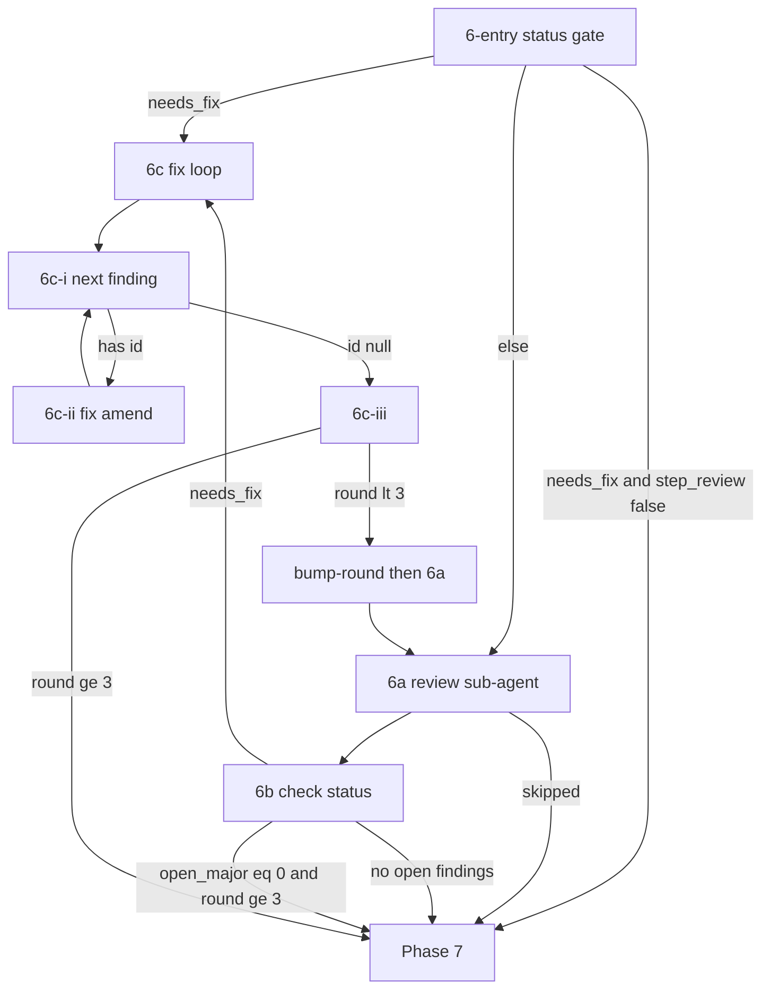

# Apply Review Loop (Phase 6)

Shared orchestration for `/spex apply` and `/spex apply-one-step`.
Load and follow this document exactly for Phase 6.

## Flow Overview



## Round Model

1. At most **3** review passes (`round` is 1, 2, or 3). `round`
   never exceeds 3 (`review-helper bump-round` enforces this).
2. Round N means the N-th review sub-agent pass on the step commit.
3. After a review in rounds 1–2 with open findings (major **or**
   minor): run the fix loop, then bump and re-review.
4. After a review in round 3:
   - no open majors → proceed to Phase 7 (open minors may remain);
   - open majors remain → enter **6c** and fix them in this same
     invocation. Do **not** bump or re-review past round 3. After
     fixes, if `open_major == 0`, proceed to Phase 7.
5. **STOP** is only for abnormal failures (e.g. fix/amend
   verification fails after relaunch). Do not STOP merely because
   round 3 found majors. `"skipped": true` from `prompt
   apply-review` is **not** a STOP — proceed to Phase 7. If an
   earlier invocation was interrupted while `needs_fix` is still
   true, a later `/spex apply` or `/spex apply-one-step` resumes
   via Phase 3 with `resume_phase=review`, then **6-entry** routes
   to **6c** (even at `round == 3`) unless `step_review` is false
   (then Phase 7). Never bump or re-review past round 3.

## Orchestration Rules (required)

The main agent orchestrates this phase. Launch a fresh **review
sub-agent** and (when needed) a fresh **fix sub-agent** each
round.

- Debug timeline: with debug enabled, `prompt apply-review` and
  `review-helper bump-round` append APPLY anchors to
  `$spec_path/debug.log` automatically. Do not call `mark-phase`.
- Run each `review-helper` / `prompt` command as its **own** shell
  invocation. Do not chain init + prompt + python one-liners.
- Parse JSON from **stdout** yourself (tool output). Status/info
  lines on stderr (e.g. template sync) must be ignored.
- Shell variables such as `$commit_sha` are not Python names — never
  reference them inside `python3 -c` unless you expand them in the
  shell string first.
- Sub-agent / amend verification failures: relaunch **at most once**;
  if it still fails, stop and report.
- **Single prompt render (required):** Run each `prompt …` at most once
  per scope — `$review_prompt` once per review round in **6a**, and
  `$fix_prompt` once per `$finding_id` in **6c-ii**. Parse the `"prompt"`
  field from stdout JSON (or plain stdout for `apply-commit`) into a
  shell variable and reuse it for sub-agent launch and relaunch. Do
  **not** re-run the same `prompt apply-review` for the same round or
  `prompt apply-fix` for the same finding because verification failed,
  a sub-agent returned incomplete work, or you are double-checking —
  unless the variable was lost (e.g. new session with no prior context).
  Track scope with companion variables so stale shell state cannot
  skip a render:
  - `$review_prompt` + `$review_prompt_round` (current review round)
  - `$fix_prompt` + `$fix_prompt_finding_id` (current finding id)
  Reuse a cached prompt **only** when its companion matches the current
  scope; otherwise treat the cache as empty and run the prompt command.
- **review-helper CLI (required):**

  ```text
  REQUIRED: --name <spec> on every invocation
  REQUIRED: --step <id> for most subcommands (status, next, show,
            append, edit, bump-round, set-commit, list, get)
  USE:      status --json | next | show --step S [--id ID]
  ALIASES:  list → show summary; get → show --id
  ```

  `--name` is always required. Prefer `status` / `next` / `show` at
  the steps below. `list` and `get` are supported aliases of `show`
  (compat); use them only with `--name` and `--step` as needed.
  To inspect one finding (e.g. verify `completed_at`), use
  `show --step "$current_task_id" --id "$finding_id" --json`
  (or `get --step … --id …`).

- **Avoid redundant status / next / show (required):** Call each
  helper only at the step that needs it. Reuse the last parsed JSON
  in shell/context — there is no process-level status cache.

  | Step | Required call | Do not |
  |------|---------------|--------|
  | 6-entry | `status --json` once | re-status before routing |
  | 6b (after review) | `status --json` once | re-status before 6c / Phase 7 |
  | 6c-i (pick finding) | `next` only | `status` (reuse prior JSON) |
  | 6c-ii (verify fix) | `show --id` once | `status` |
  | 6c-iii (`next` null) | `status --json` once | re-status after bump-round |

  Never re-run `status --json` immediately after an unchanged status
  result (same step, same argv, seconds apart). After 6b routes to
  6c, start at **6c-i** with `next` — do not status again first.
  After `bump-round` stdout confirms the new `round`, go to **6a**
  without another status.

## 6-entry. Resume / continue gate

Resolve `$commit_sha`, then branch on status (**once**):

```bash
$spex_skill_dir/scripts/spex review-helper --name $spec_name \
  status --step "$current_task_id" --json
```

Also resolve the current tip:

```bash
git rev-parse --short HEAD
```

Save as `$head_sha`. Set `$commit_sha` in this order:

1. If status JSON `"commit_sha"` is non-empty **and** equals
   `$head_sha`, use that value.
2. If status JSON `"commit_sha"` is non-empty **but differs** from
   `$head_sha`: the review file is stale after an amend — use
   `$head_sha`, then heal the file (only when `exists` is true):

   ```bash
   $spex_skill_dir/scripts/spex review-helper --name $spec_name \
     set-commit --step "$current_task_id" --commit "$commit_sha"
   ```

3. Otherwise, if `$commit_sha` is already set from Phase 5, keep it.
4. Otherwise: `$commit_sha=$head_sha`.

Then:

- If `"needs_fix": true` **and** `step_review` is false (read
  config, or probe `prompt apply-review --json` and parse
  `"skipped": true`): do **not** enter **6c**. Refresh
  `$commit_title` with `git log -1 --pretty="%h: %s"` and proceed
  to Phase 7.
- If `"needs_fix": true`: open findings remain — go to **6c**
  (fix loop). Do not start a new review first. (Allowed at any
  `round`, including 3, so resume can finish leftover findings.)
- Otherwise: go to **6a** (start or continue review).

## 6a. Review sub-agent

Do **not** run `review-helper init`. The review file is created
lazily on the first `append`. If the review finds nothing, do not
create any `review-step-*.json` file.

Run (alone — do not pipe through ad-hoc scripts):

```bash
$spex_skill_dir/scripts/spex prompt apply-review --json \
  --name $spec_name --commit "$commit_sha"
```

Parse the JSON object from stdout.

- If `"skipped": true`: do **not** launch a review sub-agent and
  do **not** pass an empty `"prompt"` to one. This is **not** a
  loop STOP. Refresh `$commit_title` with
  `git log -1 --pretty="%h: %s"` and proceed to Phase 7.
  Orchestration keys off `"skipped": true`.
- ELSE: Save `$review_prompt` from the `"prompt"` field and set
  `$review_prompt_round` from `"review_round"` in the same JSON
  (or from review `status --json` `"round"` if absent).
  If `$review_prompt` is already set **and**
  `$review_prompt_round` equals the current review round, reuse
  it — do **not** run `prompt apply-review` again. Otherwise
  clear `$review_prompt` and run the command above. Pass
  `$review_prompt` directly to a **review sub-agent** as its
  instructions — do not rewrite it via shell helpers. The review
  sub-agent must only record findings via
  `review-helper append` (with `--commit`) — it must not modify
  source code, must not call `init`, and must not call
  `bump-round`.

## 6b. Check status (after a review pass)

Run status **once**:

```bash
$spex_skill_dir/scripts/spex review-helper --name $spec_name \
  status --step "$current_task_id" --json
```

Parse that JSON and decide — do **not** re-run status before
entering 6c or Phase 7. Match **in order** (do not skip steps).
Decide from `needs_fix`, `open_major`, and `round` — **do not**
use `ready_to_complete` alone to enter Phase 7 (it is false while
open minors remain in rounds 1–2, and true at max round when only
minors remain).

1. If `"needs_fix": false` (no open findings — including when no
   review file was created because the review found nothing):
   refresh `$commit_title` with `git log -1 --pretty="%h: %s"` and
   proceed to Phase 7.
2. If `"open_major"` == 0 and `"round"` >= 3: refresh
   `$commit_title` and proceed to Phase 7 (remaining open minors
   may stay unfinished). At max round this matches
   `"ready_to_complete": true`, but earlier rounds must still fix
   minors via rule 3.
3. **Otherwise** (`needs_fix` is true — including when
   `"round"` >= 3 and `"open_major"` > 0): you **MUST** continue
   to 6c and launch the fix loop. Never proceed to Phase 7 while
   open majors remain, and never leave round-3 majors unfixed in
   this invocation. In rounds 1–2 this also includes minor-only
   reviews. A review file always exists when `needs_fix` is true.

## 6c. Fix loop — one finding at a time

Enter when 6-entry or 6b routed here with `needs_fix: true` (a
review file already exists). Fix findings **serially**. Never
batch-fix or batch-mark multiple findings in one sub-agent pass
(that produces identical `completed_at` timestamps). **Amend after
every single finding.**

### 6c-i. Pick next open finding

Use `next` only — do **not** call `status` here:

```bash
$spex_skill_dir/scripts/spex review-helper --name $spec_name \
  next --step "$current_task_id"
```

Parse JSON from stdout:

- If `"id"` is `null` / empty: all findings for this round are
  marked complete — go to **6c-iii**.
- Otherwise set `$finding_id` from `"id"`. If `$finding_id` differs
  from `$fix_prompt_finding_id`, clear the fix prompt cache
  (`unset $fix_prompt $fix_prompt_finding_id` or equivalent) before
  continuing to **6c-ii**.

### 6c-ii. Fix + amend one finding

```bash
$spex_skill_dir/scripts/spex prompt apply-fix --json \
  --name $spec_name --commit "$commit_sha" \
  --finding-id "$finding_id"
```

Parse `"prompt"` into `$fix_prompt` and set
`$fix_prompt_finding_id="$finding_id"`. If `$fix_prompt` is already
set **and** `$fix_prompt_finding_id` equals `$finding_id`, reuse it —
do **not** run `prompt apply-fix` again for the same finding.
Otherwise clear `$fix_prompt` and run the command above. Launch a **fresh
fix sub-agent** with `$fix_prompt`. That sub-agent must:

- Fix **only** `$finding_id`
- Call `review-helper edit --id $finding_id --completed-at now`
  after that single fix (not before, not for other ids)
- **Amend immediately** after marking that finding complete
- **Not** mark other findings complete
- **Not** call `bump-round`

Amend constraints:

- `HEAD` must still be `$commit_sha` / the step commit under review.
- The commit must not have been pushed to a remote.
- Do not amend someone else's commit.
- Do NOT stage any files under `$spex_root/`.

After the fix sub-agent returns:

- Verify `$finding_id` has a non-empty `completed_at`:

  ```bash
  $spex_skill_dir/scripts/spex review-helper --name $spec_name \
    show --step "$current_task_id" --id "$finding_id" --json
  ```

  If not, relaunch the fix sub-agent once with the same `$fix_prompt`;
  if it still fails, stop and report.
- Refresh the SHA after this amend with
  `git rev-parse --short HEAD`. Save to `$commit_sha` (required —
  the next finding amends this new HEAD).
- Persist the new tip into the review file so resume does not use
  a stale SHA:

  ```bash
  $spex_skill_dir/scripts/spex review-helper --name $spec_name \
    set-commit --step "$current_task_id" --commit "$commit_sha"
  ```

- Go back to **6c-i** for the next open finding.

### 6c-iii. Bump round or finish (hard cap)

When `next` reports no open findings, run status **once** to decide
whether to re-review (do not status again after this decision):

```bash
$spex_skill_dir/scripts/spex review-helper --name $spec_name \
  status --step "$current_task_id" --json
```

- If `"round"` < 3: bump round and sync `commit_sha` (findings
  preserved), then go back to **6a**:

  ```bash
  $spex_skill_dir/scripts/spex review-helper --name $spec_name \
    bump-round --step "$current_task_id" --commit "$commit_sha"
  ```

  Confirm stdout JSON shows the new `round` and `commit_sha` — that
  is enough; do **not** re-run `status` after a successful bump.
  Clear the review prompt cache
  (`unset $review_prompt $review_prompt_round` or equivalent) so
  **6a** renders a fresh `prompt apply-review` for the new round.
  Then go back to **6a** (fresh review sub-agent on the latest
  amended commit).

- If `"round"` >= 3: **do not bump** and **do not re-review**.
  Refresh `$commit_title` and proceed to Phase 7. (After a
  successful fix loop, `open_major` should be 0. If fix/amend
  verification failed earlier, that path already stopped and
  reported.)

If `bump-round` exits non-zero because the round cap was reached,
treat it the same as the `round >= 3` case (never force a fourth
review).
